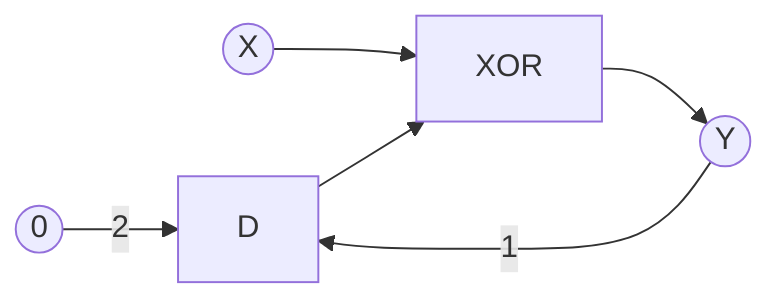

# Logic Simulator and Circuit Language Guide

This document explains the circuit description language and the simulation process, using a full adder circuit as a practical example.

## 1. The Circuit Description Language

The simulator uses a simple language to define digital logic circuits. The core components are signals, gates, and macros.

### Signals and Connections
- **Signals** are the "wires" of your circuit. They can be inputs, outputs, or internal connections. Signal names are case-sensitive.
- **Connections** are made using the `=` operator. The left side is the output signal, and the right side is a gate expression.
  ```
  C = NAND(A, B)
  ```

### Built-in Gates
The simulator has two built-in gates:
- `NAND(a, b)`: The universal NAND gate.
- `D(a, default)`: A D-type flip-flop, which introduces a one-step delay. This is the primary element for creating sequential (stateful) circuits. The default value is used for the first step when there is no previous state.

All other common logic gates (`AND`, `OR`, `NOT`, etc.) can be defined by the user using the macro system.

### Macros
Macros allow you to define reusable circuit components. This is powerful for building complex circuits from simpler ones.
- **Definition:** Use the `:=` operator.
- **Syntax:** `MACRO_NAME(param1, param2, ...) := expression`

**Example: Defining standard gates from `NAND`**
All standard logic gates can be created from `NAND`.
```
NOT(x) := NAND(x, x)
AND(a, b) := NOT(NAND(a, b))
OR(a, b) := NAND(NOT(a), NOT(b))
XOR(a, b) := NAND(NAND(a, NOT(b)), NAND(NOT(a), b))
```
You can then use these macros just like built-in gates.

## 2. Simulation Tutorial: Building a Checksum (Parity) Circuit

Let's use a simple checksum circuit as an example. This circuit calculates the running parity (the XOR sum of all bits) of a single input stream `X`. The output `Y` will be `1` if an odd number of `1`s have been received, and `0` otherwise.

Here is the complete circuit for the checksum:

```
# Checksum (Parity) Circuit
# Computes the parity (XOR of all bits) of input X

# Macro definitions (using only NAND as a primitive gate)
NOT(x)      := NAND(x, x)
AND(x,y)    := NOT(NAND(x, y))
OR(x,y)     := NAND(NOT(x), NOT(y))
XOR(x,y)    := OR(AND(NOT(x), y), AND(x, NOT(y)))

# Use a D flip-flop to accumulate the running parity
# At each step, parity = XOR of previous parity and current bit
Y = XOR(D(Y, 0), X)
```

### How to Run the Simulation
1.  **Paste the Code:** Copy the checksum circuit code above into the circuit editor in the web interface.
2.  **Set the Inputs:** In the "Inputs" text field, define the values for the input signal `X`. Let's use an 8-step sequence:
    ```
    X=11010010
    ```
3.  **Set the Steps:** The number of steps will be automatically inferred from the length of the input sequence (8).
4.  **Run the Simulation:** Click the **Simulate** (▶) button.

### How to Interpret the Output
After the simulation runs, the "Outputs" panel will display the final values of all signals. For the input `X=11010010`, the output `Y` will be `10011100`.

This output shows the state of the running parity at each step.
- At step 1, the first input is `1`. The previous parity was `0` (the default). `Y` becomes `XOR(0, 1) = 1`.
- At step 2, the input is `1`. The previous parity was `1`. `Y` becomes `XOR(1, 1) = 0`.
- At step 3, the input is `0`. The previous parity was `0`. `Y` becomes `XOR(0, 0) = 0`.
- At step 4, the input is `1`. The previous parity was `0`. `Y` becomes `XOR(0, 1) = 1`.
- ...and so on. The final value of `Y` is `0` because the input sequence contains four `1`s (an even number), so the final parity is even.

### Checksum Circuit Diagram
Below is a diagram of the checksum circuit consisting of a single XOR gate and a D-type flip-flop creating a feedback loop. Circles represent signals, rectangles represent gates and the numbers on the arrows mark the order of the parameters to a gate, if this matters (e.g. for D gates).



The `D` gate (D-type flip-flop) is used to create circuits with memory (sequential logic). It introduces a one-step delay, meaning its output at a given step is equal to its input from the *previous* step. It is essential for storing the state of the circuit between steps, allowing us to build more complex behaviors like counters and state machines.


<!-- ## 3. Solved Example: 3-Bit Counter

Here is the complete circuit for a 3-bit synchronous counter that increments whenever its input `I` is `1`.


```
# Macro Definitions
AND(x,y)    := NAND(NAND(x, y), NAND(x, y))
XOR(x,y)    := NAND(NAND(x, NAND(x, y)), NAND(y, NAND(x, y)))

# A 3-bit binary counter using D flip-flops
D0=D(O0,0)
D1=D(O1,0)
C1=AND(D0,I)

O0 = XOR(D0,I)
O1 = XOR(D1, C1)
O2 = XOR(D(O2,0), AND(D1, C1))
```

### Counter Circuit Diagram

This diagram shows the structure of the 3-bit counter. Signals in yellow circles (`O0`, `O1`, `O2`, etc.) are generated signals that can be used as inputs to other gates.

```mermaid
graph LR

        subgraph Least Significant Bit 
            XOR0 --> O0((O0))
            D0 --> XOR0(XOR)
            O0 --> DD0(D) --> D0((D0))
            I((I)) --> XOR0
            D0 --> AND0(AND)
            I --> AND0
        end

        AND0 --> C1((C1))

        subgraph Middle Bit
            direction LR
            XOR1 --> O1((O1))
            D1 --> XOR1(XOR)
            O1 -->  DD1(D) --> D1((D1))
            C1 --> XOR1(XOR)
            D1 --> AND1(AND)
            C1 --> AND1
        end


        subgraph Most Significant Bit
            direction LR
            XOR2 --> O2((O2))
            D2 --> XOR2(XOR)
            O2 -->  D2(D)
            AND1 --> XOR2 
        end


    classDef highlight fill:#fffccc;
    class O0,O1,O2,D0,D1,C1,I highlight;
``` -->


