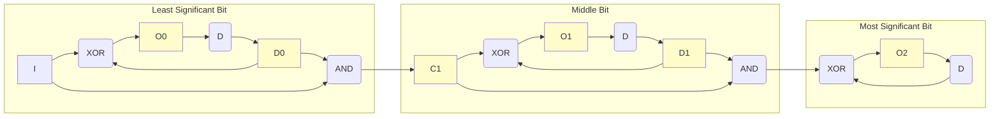

# Logic Simulator and Circuit Language Guide

This document explains the circuit description language and the simulation process, using a full adder circuit as a practical example.

## 1. The Circuit Description Language

The simulator uses a simple language to define digital logic circuits. The core components are signals, gates, and macros.

### Signals and Connections
- **Signals** are the "wires" of your circuit. They can be inputs, outputs, or internal connections. Signal names are case-sensitive.
- **Connections** are made using the `=` operator. The left side is the output signal, and the right side is a gate expression.
  ```
  C = NAND(A, B)
  ```

### Built-in Gates
The simulator has two built-in gates:
- `NAND(a, b)`: The universal NAND gate.
- `D(a, default)`: A D-type flip-flop, which introduces a one-step delay. This is the primary element for creating sequential (stateful) circuits. The default value is used for the first step when there is no previous state.

All other common logic gates (`AND`, `OR`, `NOT`, etc.) can be defined by the user using the macro system.

### Macros
Macros allow you to define reusable circuit components. This is powerful for building complex circuits from simpler ones.
- **Definition:** Use the `:=` operator.
- **Syntax:** `MACRO_NAME(param1, param2, ...) := expression`

**Example: Defining standard gates from `NAND`**
All standard logic gates can be created from `NAND`.
```
NOT(x) := NAND(x, x)
AND(a, b) := NOT(NAND(a, b))
OR(a, b) := NAND(NOT(a), NOT(b))
XOR(a, b) := NAND(NAND(a, NOT(b)), NAND(NOT(a), b))
```
You can then use these macros just like built-in gates.

## 2. Simulation Tutorial: Building a 3-Bit Counter

Let's use a 3-bit binary counter as an example. This circuit increments its value on each clock cycle when the input signal `I` is high (1).

Here is the complete circuit for the counter:

```
# Macro Definitions (using only NAND as a primitive gate)
AND(x,y)    := NAND(NAND(x, y), NAND(x, y))
XOR(x,y)    := NAND(NAND(x, NAND(x, y)), NAND(y, NAND(x, y)))

# An n-bit binary counter using D flip-flops and NAND gates
D0=D(O0,0)
D1=D(O1,0)
C1=AND(D0,I)

O0 = XOR(D0,I)
O1 = XOR(D1, C1)
O2 = XOR(D(O2,0), AND(D1, C1))
```

### How to Run the Simulation
1.  **Paste the Code:** Copy the 3-bit counter circuit code above into the circuit editor in the web interface.
2.  **Set the Inputs:** In the "Inputs" text field, define the values for the input signal `I`. The counter state signals (`O0`, `O1`, `O2`) are initialized by the `D(..., 0)` gate, so we only need to provide the `I` sequence. Let's use a 16-step sequence:
    ```
    I=0010010100101111
    ```
3.  **Set the Steps:** The number of steps will be automatically inferred from the length of the input sequence, which is 16. You can also set it manually.
4.  **Run the Simulation:** Click the **Simulate** (▶) button.

### How to Interpret the Output
After the simulation runs, the "Outputs" panel will display the final values of all signals. To see the step-by-step history, view the "Log". For the input `I=0010010100101111`, the history will show:

```
I:    0010010100101111
O0:   0011100111001010
O1:   0000011111000110
O2:   0000000000111110
```

This output shows the state of the counter at each of the 16 simulation steps. The signals `O2`, `O1`, and `O0` represent a 3-bit binary number, where `O2` is the most significant bit and `O0` is the least significant bit. This number is the total count of `1`s that have appeared in the input signal `I` up to that point in time.

For example, let's look at the 8th step:
- The input `I` up to step 8 is `00100101`. It contains three `1`s.
- At step 8, the output is `O2=0`, `O1=1`, `O0=1`.
- Reading `(O2, O1, O0)` as `011` gives the binary representation for the number 3, which correctly matches the number of `1`s seen in the input.

By the end of the simulation (step 16), the input `I` has contained eight `1`s. The counter value `(O2, O1, O0)` is `000`, because the 3-bit counter has counted to 7 and then wrapped around back to 0.

### Counter Circuit Diagram

Below is a diagram of the 3-bit synchronous counter we created above. The yellow-highlighted signals (`O0`, `O1`, `O2`, `D0`, `D1`, and `C1`) are generated signals. We need to generate an intermediate signal if we want to send the output of a gate to multiple other gates. We also generated the signals O0, O1, and O2 to represent the output of the circuit (the counter's current state).



## 3. Advanced Concepts: Sequential Circuits

The `D` gate (D-type flip-flop) is used to create circuits with memory (sequential logic). It introduces a one-step delay, meaning its output at a given step is equal to its input from the *previous* step. The counter example above makes extensive use of it to store its state between steps.


